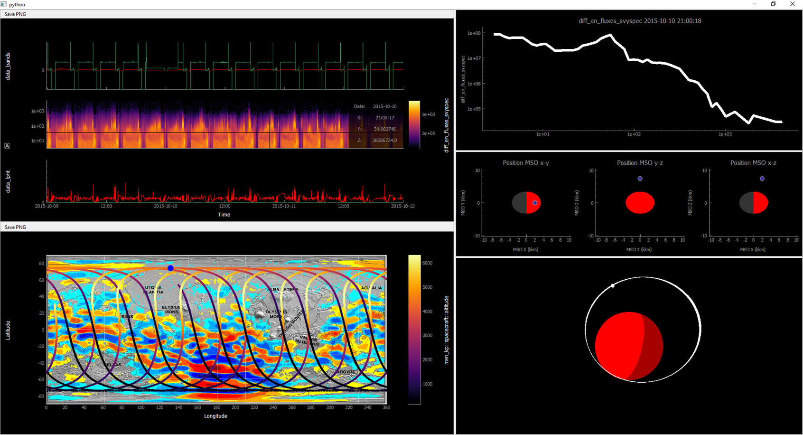

Introduction
===================

What is PyDIVIDE?
------------------

PyDIVIDE a toolkit for manipulating and visualizing data from the MAVEN mission.  The toolkit started in IDL, but the core functionality has been ported over into python. 
The tool has primarily been focused on the Key Parameter dataset in the past, but due to the limited nature of that dataset will soon focus more on the Level 2 data.  

It can plot using either Qt via pytqtgraph, or by creating HTML files via Bokeh.  

What does it do?
-------------------

There are a few major things the tool does:

* Downloads data files from the MAVEN Science Data Center 
* Reads in data from Key Parameter data files 
* Plots data in a variety of ways (Time, Altitude, Lat vs Lon, etc)
* Reads in data files from models of the Martian Atmosphere
* Provides time series data analysis/manipulation routines

Pyqtgraph Sample
-----------------

   
   