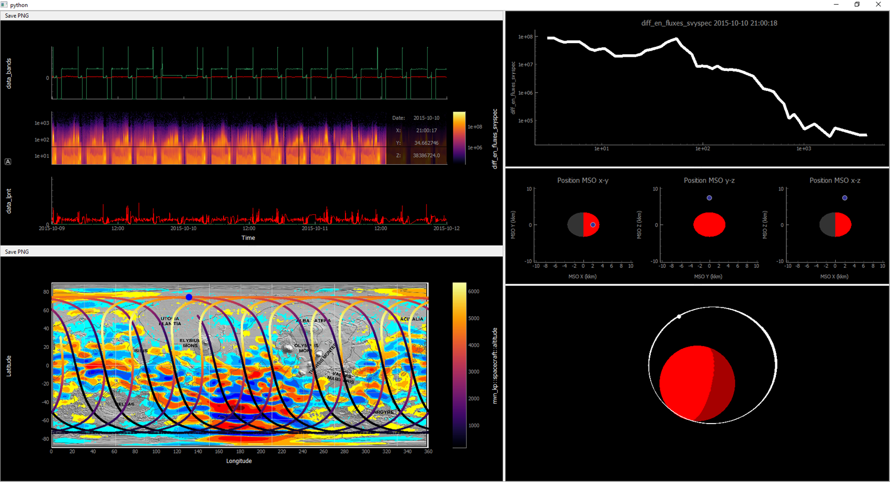

Plotting Level 2 Data
=============================

PyDIVIDE is currently in a strange place right now, and in the future may further depend on PySPEDAS or even become a part of that library.  Currently, we have only one routine to display level 2 data.  
 

Additional Requirements
-----------------------

All level 2 data plotting routines will rely on PySPEDAS for loading the data into memory (into xarrays).  This library can be installed via ::

	pip install pyspedas

Full Plots
----------------

This routine was created as a way to uniquely visualize the MAVEN data, as well as display the capabilities of PySPEDAS and PyTplot.  Currently, it only works with the pyqtgraph visualization library, but hopefully a bokeh window will be added in the future.  

If you would like the fully interactive 3D window to appear, you must first run :: 
	
	pip install pyopengl  

.. autofunction:: pydivide.fullplot

